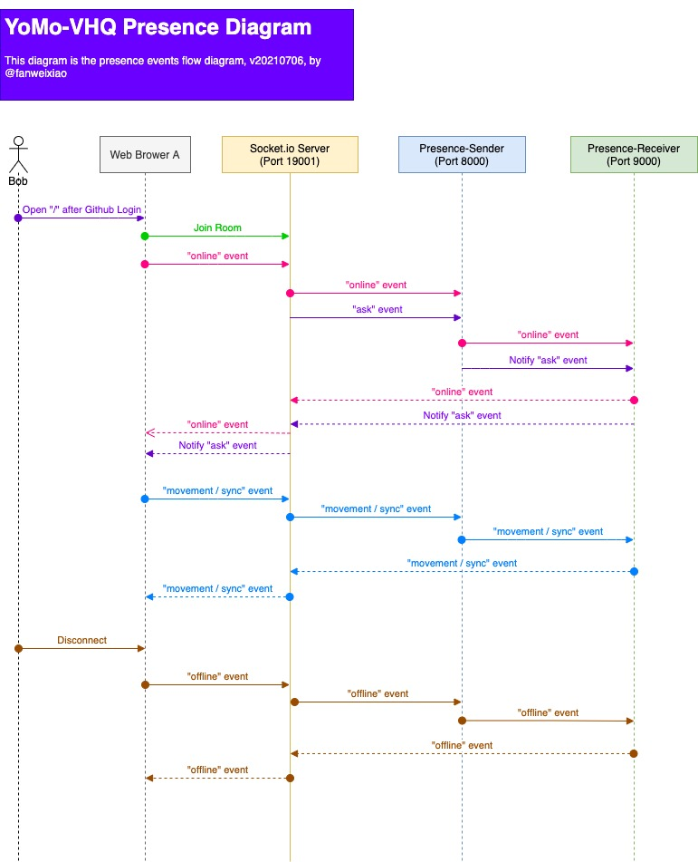

# yomo-vhq-nextjs

An open-source [Metaverse Workplace](https://techcrunch.com/2020/11/18/virtual-hqs-race-to-win-over-a-remote-work-fatigued-market/) with Geo-distributed System Tech Stacks.

## Presence Message Flow

## Tech Stacks

- [Vercel - Frontend Deployment](https://vercel.com)
- [Macrometa - Geo-distributed Database](https://macrometa.dev/)
- [YoMo - Geo-distributed Presence server](https://github.com/yomorun/yomo)
- [Agora - Video/Audio](https://agora.io)
- [Next.js - Frontend](https://nextjs.org)

## Development

`npm run dev` then open https://localhost:3000

## Sponsors

## LICENSE 
[MIT](LICENSE)
