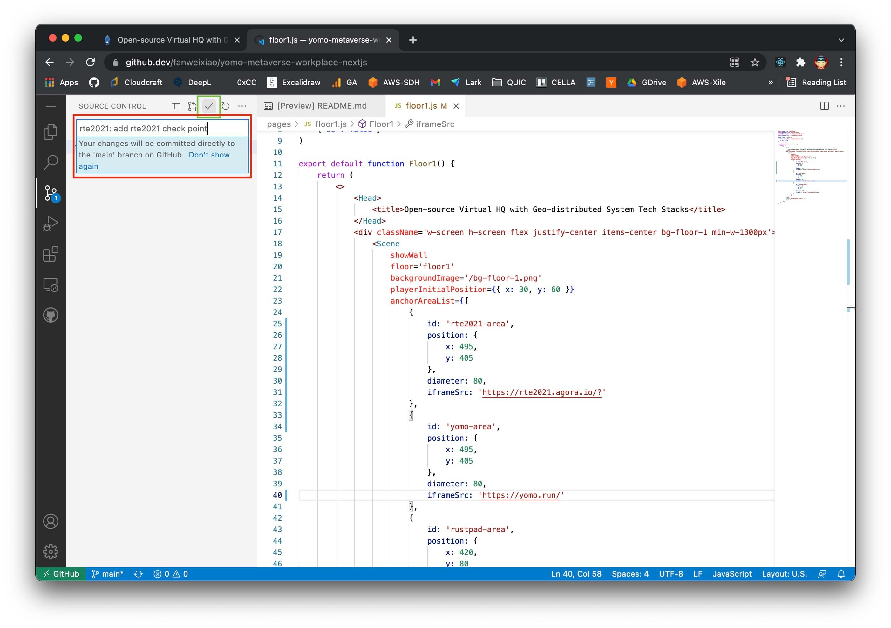

# RTE2021 Conf - Realtime Engagement Goes Global

## 实时应用贡献指南

用户可使用 `W`、`A`、`S`、`D` 移动自己的位置，
当用户进入下图蓝色区域时，会触发该 `Check Point` 对应的事件，自动展示对应的应用：

1. 若希望将您自己的 Realtime Application 加入到该系统，
首先打开该项目的 Github 地址：https://github.com/yomorun/yomo-metaverse-workplace-nextjs ，
并 `Fork` 至您自己的 Github 账号下：

2. 将浏览器地址栏的 `github.com` 更改为 `github.dev`，会加载 Web 版本的 Visual Studio Code：

3. 双击左侧 `pages/floor1.js` 打开该文件，并在右侧选中区域添加您的内容

4. 点击左侧 `Git` 图标，填写 `Git commit message`，
以 `rte2021: add xxxx check point` 格式撰写，然后点击 ✅ ，进行 Git 提交

5. 回到 Github 上您 fork 的 repo 页面，点击 `Contribute` ，然后 `Open pull request`

6. 点击 `Create pull request`

7. `Reviewer` 请选择 [@Yoname](https://github.com/yoname), [@venjiang](https://github.com/venjiang), [@fanweixiao](https://github.com/fanweixiao) ,
`Labels` 请选择 `rte2021`，
机器人将会加速审核

8. 完成，等待 Review 结束后会自动 Merge 并自动发布到 https://vhq.yomo.run

### 项目支持

有任何问题可随时在活动官网、微信群群中咨询

